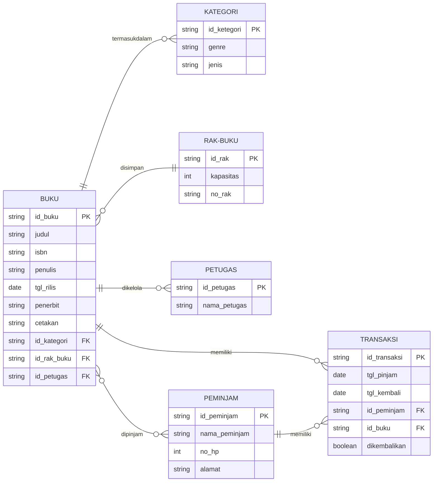

## DATABASE

```mermaid


erDiagram
direction LR
BUKU ||--o{ KATEGORI : termasukdalam
BUKU }o--|| RAK-BUKU : disimpan
BUKU ||--o{ PETUGAS : dikelola
BUKU }o--o{ PEMINJAM : dipinjam
BUKU ||--o{ TRANSAKSI : memiliki
BUKU {
string id_buku PK
string judul
string isbn
string penulis
date tgl_rilis
string penerbit
string cetakan
string id_kategori FK
string id_rak_buku FK
string id_petugas FK

}
KATEGORI {
string id_ketegori PK
string genre
string jenis
}
RAK-BUKU {
string id_rak PK
int kapasitas
string no_rak
}
PETUGAS {
string id_petugas PK
string nama_petugas
}
PEMINJAM ||--o{ TRANSAKSI : memiliki
PEMINJAM {
string id_peminjam PK
string nama_peminjam
int no_hp
string alamat
}
TRANSAKSI {
string id_transaksi PK
date tgl_pinjam
date tgl_kembali
string id_peminjam FK
string id_buku FK
boolean dikembalikan
}


```
