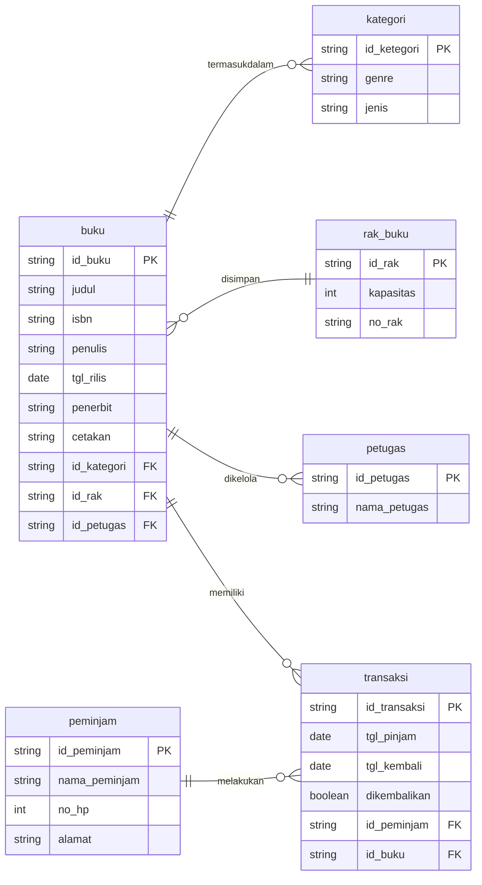

# 📚 Sistem Peminjaman Buku

Sistem ini merupakan aplikasi sederhana untuk mengelola peminjaman buku oleh pengguna.

```mermaid


erDiagram
direction LR
buku ||--o{ kategori : termasukdalam
buku }o--|| rak_buku : disimpan
buku ||--o{ petugas: dikelola
buku ||--o{ transaksi: memiliki

buku {
string id_buku PK
string judul
string isbn
string penulis
date tgl_rilis
string penerbit
string cetakan
string id_kategori FK
string id_rak FK
string id_petugas FK

}

kategori{
string id_ketegori PK
string genre
string jenis
}

rak_buku{
string id_rak PK
int kapasitas
string no_rak
}

petugas{
string id_petugas PK
string nama_petugas
}

peminjam ||--o{ transaksi : melakukan

peminjam {
string id_peminjam PK
string nama_peminjam
int no_hp
string alamat
}

transaksi {
string id_transaksi PK
date tgl_pinjam
date tgl_kembali
boolean dikembalikan
string id_peminjam FK
string id_buku FK
}


```
